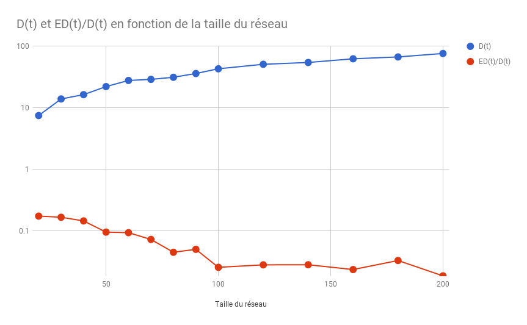
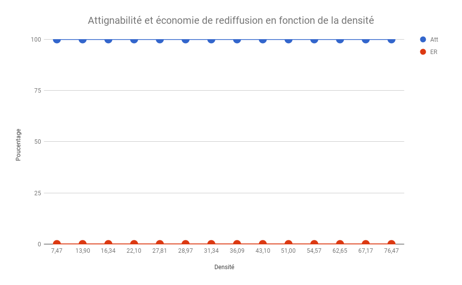
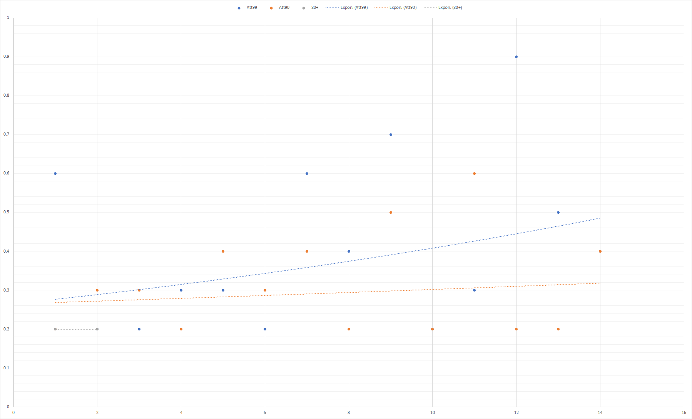
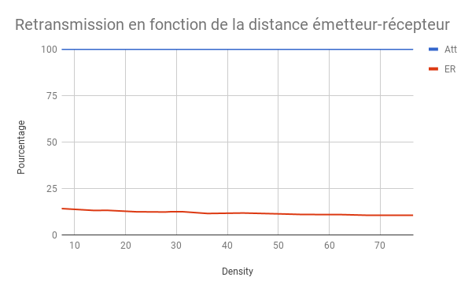

# <center>Projet Algorithmique Répartie Avancée</center>
### <center> _Jonathan Lejeune_ </center>
### <center> Zakaria Amri, Saalik Hatia </center>


<center> _2017-2018_ </center>

# Objectifs

L'objectif principal de ce projet est d'étudier les performances de différents algorithmes de diffusion de messages sur des réseaux mobiles ad hoc, appelés plus couramment MANET (Mobile Ad hoc NETworks).

# Exercice 1 : Implémentation d'un MANET dans PeerSim

## Question 1

_En analysant le code de la classe PositionProtocolImpl ,_
_donnez l'algorithme général de déplacement d'un noeud._
_Il ne vous est pas demandé de code dans cette question._

```
L'algorithme :

Si le noeud est static :
		- Vitesse <- Rand(Min,Max) 
		- Prochaine Destination <- Depuis Stratégie
		- Le noeud est en mouvement
Si le noeud est en mouvement :
		- Eval de la destination
		Si destination est atteignable :
			- Le noeud s'arrète a l'arrivée
		Sinon
			- Sinon on se deplace au plus prêt

```

## Question 2

_Testez le simulateur en prenant la stratégie 1 comme SPI et SD._
_Vous répondrez à cette question en donnant le contenu de votre fchier de configuration._

```C
	simulation.endtime 1200000
	random.seed 25
	network.size 50


	protocol.positionP manet.positioning.PositionProtocolImpl
	protocol.positionP.maxspeed 20
	protocol.positionP.minspeed 1
	protocol.positionP.width 1500
	protocol.positionP.height 1500
	protocol.positionP.pause 100

	init.init Initialisation
	init.init.position_protocol positionP

	initial_position_strategy manet.positioning.strategies.Strategy1InitNext
	initial_position_strategy.positionprotocol positionP

	next_destination_strategy manet.positioning.strategies.Strategy1InitNext
	next_destination_strategy.positionprotocol positionP
```


## Question 3

_Que fait la stratégie 1 ?_

Strategie initiale : La position initiale est choisit aléatoirement. 
Strategie de déplacement : La destination d'un point est choisit aléatoirement.


## Question 4

_Re-testez en prenant en SD, la stratégie 2 (la stratégie 1 reste la SPI). Que fait la stratégie 2 ?_


La stratégie 2 : Les noeuds ne se déplace pas car la destination d'un noeud est sa position courante


## Question 5
_Codez une classe implémentant l'interface Emitter._

```Java
public class EmitterImpl implements Emitter{

    private static final String PAR_LATENCY="latency";
    private static final String PAR_SCOPE="scope";
    private static final String PAR_POSITIONPROTOCOLPID="positionprotocol";
    private final int latency;
    private final int scope;
    private final int position_pid;
    private final int my_pid;


    public EmitterImpl(String prefix) {
        String tmp[]=prefix.split("\\.");
        my_pid=Configuration.lookupPid(tmp[tmp.length-1]);
        this.latency=Configuration.getInt(prefix+"."+PAR_LATENCY);
        this.scope=Configuration.getInt(prefix+"."+PAR_SCOPE);
        this.position_pid=Configuration.getPid(prefix+"."+PAR_POSITIONPROTOCOLPID);
    }

    @Override
    public void emit(Node host, Message msg) {
        int neighbor= Configuration.lookupPid("neighbor");
        PositionProtocolImpl hostpos = (PositionProtocolImpl) host.getProtocol(position_pid);
        for(int i = 0; i< Network.size() ; i++) {
            Node n = Network.get(i);
            PositionProtocolImpl postmp = (PositionProtocolImpl) n.getProtocol(position_pid);
            if(postmp.getCurrentPosition().distance(
				hostpos.getCurrentPosition()) < getScope() && !(n.equals(host)) ) {
                	EDSimulator.add(getLatency(), new Message(msg.getIdSrc(), 
					n.getID(), "PROBE","PROBE", neighbor), n, neighbor);
            }
        }
    }

    public int getPosition_pid() {
        return position_pid;
    }

    @Override
    public int getLatency() {
        return latency;
    }

    @Override
    public int getScope() {
        return scope;
    }

    @Override
    public Object clone() {
        EmitterImpl res = null;
        try{
            res = (EmitterImpl) super.clone();
        }catch (CloneNotSupportedException e){
            System.out.println("Error in EmitterImpl cloning");
            e.printStackTrace();
        }
        return res;
    }
}

```

La classe EmitterImpl est plutot simple, ici le contenu du message envoyé peut être récupérer depuis msg.getTag() et msg.getContent() il a été écrit en dur pour la lisibilité du code. Des getters on été rajouter dans le code afin de prévoir d'éventuelle évolution du code et minimiser l'impact sur le code de l'envoie en lui même. 


## Question 6

_Codez une classe implantant l'interface NeigborProtocol_

```Java
package manet.detection;
import manet.Message;
import manet.communication.EmitterImpl;
import peersim.config.Configuration;
import peersim.core.Node;
import peersim.edsim.EDProtocol;
import peersim.edsim.EDSimulator;

import java.util.*;


public class NeighborProtocolImpl implements NeighborProtocol, EDProtocol{
    private List<Long> neighbors;
    private Hashtable<Long,Integer> timerList= new Hashtable<>();
    private static final String PAR_PERIOD="period";
    private static final String PAR_TIMER="timer";
    private static final String PAR_NEIGHBORHOODPID="neighborhoodlistener";
    private final int my_pid;
    private final int period;
    private final long timer;
    private int neighborhood_pid;

    public NeighborProtocolImpl(String prefix) {
        String tmp[]=prefix.split("\\.");
        my_pid=Configuration.lookupPid(tmp[tmp.length-1]);
        this.period=Configuration.getInt(prefix+"."+PAR_PERIOD);
        this.timer=Configuration.getInt(prefix+"."+PAR_TIMER);
        this.neighborhood_pid=Configuration.getPid(prefix+"."+PAR_NEIGHBORHOODPID,-1);
        neighbors = new ArrayList<>();
    }

    @Override
    public void processEvent(Node node, int pid, Object event) {

            if (pid != my_pid) {
                throw new RuntimeException("Receive Event for wrong protocol");
            }
            if (event instanceof Message) {
            String ev = (String) ((Message) event).getTag();
            switch (ev) {
                case "HEARTBEAT":
                    EDSimulator.add(getPeriod(), new Message(node.getID(),
                            0, "HEARTBEAT","HEARTBEAT", pid), node, my_pid);
                    int emitter = Configuration.lookupPid("emitter");
                    EmitterImpl emi = (EmitterImpl) node.getProtocol(emitter);
                    emi.emit(node, new Message(node.getID(), 0,
                            "PROBE", "PROBE", pid));
                    break;
                case "PROBE":
                    long idSrc = ((Message) event).getIdSrc();
                    if(!neighbors.contains(idSrc))
                        neighbors.add(idSrc);
                    if(timerList.containsKey(idSrc)){
                        timerList.put(idSrc,(timerList.get(idSrc)+1));
                    }else {
                        timerList.put(idSrc, 1);
                    }
                    EDSimulator.add(getTimer(), new Message(idSrc, node.getID(),
                            "TIMER","TIMER", pid), node, my_pid);
                    break;
                case "TIMER":
                    idSrc = ((Message) event).getIdSrc();
                    if(neighbors.contains(idSrc)){
                        if(timerList.containsKey(idSrc)){
                            timerList.put(idSrc,(timerList.get(idSrc)-1));
                            if((timerList.get(idSrc)==0)){
                                neighbors.remove(idSrc);
                            }
                        }
                    }

                    break;
                default:
                    //System.out.println("DEFAULT" + ev);
                    break;
            }
            return;
        } else {
            System.out.println(event);
            throw new RuntimeException("Receive unknown Event");
        }
    }

    @Override
    public List<Long> getNeighbors() {
        return neighbors;
    }

    public long getTimer() {
        return timer;
    }

    public int getPeriod() { return period; }

    public int getNeighborhood_pid() { return neighborhood_pid; }

    public int getNumberOfNeighbors(){ return neighbors.size(); }

    @Override
    public Object clone() {
        NeighborProtocolImpl res = null;
        try{
            res = (NeighborProtocolImpl) super.clone();
            res.neighbors = new ArrayList<>();
            res.timerList = new Hashtable<>();
        }catch (CloneNotSupportedException e){
            System.out.println("Error in Neighbor" +
                    "ProtocolImpl cloning");
            e.printStackTrace();
        }
        return res;
    }
}


```

Ici le défi a été de gérer les timers de façon élégante sans trop surchargé le code. La stratégie appliquée ici pour permettre de prendre en compte les timers multiple qui sont envoyés durant la présence de deux noeuds dans leurs scope mutuel. 
La solution implémentée est que chaque noeud a une hashtable pour chaque noeud de son voisinage. A chaque timer envoyé pour un voisin donné il créer une entrée dans sa list de timer et incrémente sont compteur. Et a la réception l'entier est décrémenté lorsque la valeur atteint 0 c'est que le timer est bien le dernier envoyé. Cette solution supporte très bien les entrelacements de timer.

La hashtable etant un peu plus complexe a manipulé qu'une hashmap elle est nativement synchronised et ce code peut eventuellement être porté sur un système avec plusieurs threads.   

## Question 7
_Testez votre code, et remarquez sur le moniteur graphique que lorsque deux noeuds sont atteignables entre eux alors un lien graphique apparaît._

## Question 8
_Re-exécutez votre code avec les SPI et SD non encore testées et expliquez ce que fait chaque stratégie en précisant si elles assurent un graphe connexe à termes._

Strategie d'initialisation

Strategie 3 :
defini un carré dans la frame en fonction du scope des noeuds et place  les noeuds de manière aléatoire dans cette frame. Initialement pas connexe.

Strategie 5 :
Position les noeud en haut et à droite de la frame et dans le scope d'un noeud afin d'assurer un graphe connexe a l'initialisation.

Strategie 6 :
Positionne les noeuds en étoile au milieu du terrain, le graphe est connexe a l'initialisation.

Stratégie de déplacement

Stratégie 3 :
Elle permet de déplacer les noeud vers le centre de la frame et d'avoir un graphe connexe.

Strategie 4 :
Initialement, on debut avec un graphe connexe. Il ne peut y avoir qu'un noeud en mouvement et il se deplace de façon a maintenir la connexité.


## Question 9

Code du DensityControler

```Java
public class DensityControler implements Control{

    private static final String PAR_NEIGHBOR="neighborprotocol";
    private static final String PAR_ITERATIONS="iteration";
    private double actualAverage;
    private double actualStandardDeviation;
    private double accA;
    private double accuSD;
    private int tNum = 0;
    private final int neighbor_pid;
    private static int iteration;
    private ArrayList<Double> allA = new ArrayList();
    private double aa = 0;
    private double asd = 0;

    public DensityControler(String prefix) {
        this.neighbor_pid =Configuration.getPid(prefix+"."+PAR_NEIGHBOR);
        iteration =Configuration.getInt(prefix+"."+PAR_ITERATIONS);
    }

    @Override
    public boolean execute() {
        tNum++;
        double avg = average();
        double sd = standardDeviation();
        aa = averageAverage();
        asd = averageStandardDivision();
        double edt = eDt();
        //itération = 210 pour Simul exo 1 et 330 simul exo 2
        if(tNum == iteration) {
            System.out.print(": " + aa);
            System.out.print(": " + (asd / aa));
            System.out.println(": " + (edt / aa));
        }
        return false;
    }

    private double average (){
        double average = 0;
        for(int i = 0 ; i< Network.size() ; i++){
            Node n = Network.get(i);
            NeighborProtocolImpl nei = (NeighborProtocolImpl) n.getProtocol(neighbor_pid);
            average += nei.getNumberOfNeighbors();
        }
        this.actualAverage = average/Network.size();
        allA.add(actualAverage);
        return actualAverage;
    }

    private double standardDeviation (){
        double standardDeviation = 0;
        for(int i = 0 ; i< Network.size() ; i++){
            Node n = Network.get(i);
            NeighborProtocolImpl nei = (NeighborProtocolImpl) n.getProtocol(neighbor_pid);
            standardDeviation += Math.pow((nei.getNumberOfNeighbors()-actualAverage),2);
        }
        standardDeviation = standardDeviation/(Network.size()-1);
        actualStandardDeviation = Math.sqrt(standardDeviation);
        standardDeviation = actualStandardDeviation;
        return standardDeviation;
    }

    private double averageAverage (){
        accA +=actualAverage;
        aa = accA/tNum;
        return aa;
    }

    private double averageStandardDivision (){
        accuSD +=actualStandardDeviation;
        asd = accuSD/tNum;
        return asd;
    }

    private double eDt(){
        double value = 0;
        for(int i= 0;i < allA.size(); i++){
            value += Math.pow(allA.get(i)-aa,2);
        }
        value =value/tNum;
        return Math.sqrt(value);
    }
}
```


## Question 10


| Portée | SPI |  SD |  Dt |  Et/Dt |  EDt/Dt |
|---|---|---|---|---|---|
| 125 |  1|  1| 1.03| 0.96| 0.2|
| 250 |  1|  1| 3.82| 0.53| 0.11|
| 375 |  1|  1| 8.05| 0.41| 0.1|
| 500 |  1|  1| 12.82| 0.35| 0.1|
| 625 |  1|  1| 18.8| 0.33| 0.11|
| 750 |  1|  1| 23.86| 0.31| 0.08|
| 875 |  1|  1| 30.46| 0.27| 0.08|
| 1000 |  1|  1| 35.05| 0.22| 0.07|
| 125 |  3|  3| 30.29| 0.26| 0.07|
| 250 |  3|  3| 26.34| 0.29| 0.07|
| 375 |  3|  3| 26.17| 0.3| 0.07|
| 500 |  3|  3| 25.59| 0.3| 0.1|
| 625 |  3|  3| 25.94| 0.3| 0.08|
| 750 |  3|  3| 25.38| 0.29| 0.08|
| 875 |  3|  3| 25.08| 0.29| 0.09|
| 1000 |  3|  3| 25.20| 0.30| 0.08|


## Question 11

_Pour les deux stratégies considérées, quelle est l'impact de la portée sur la densité ?_

Strategie 1 :
Plus le scope est grand, plus la densité augmente. La taille de leurs environnement étant fixe et leurs destinations étant aléatoire il est donc logique que l'augmentation du scope influe la densité.

Strategie 3 :
Plus le scope est grand, plus la densité diminue. Le graphe étant connexe a l'origine leurs déplacement aleatoire avec leurs forte densité ne fait qu'impacté négativement la densité. 

# Exercice 2 :Étude de protocoles de diusion

## Question 1

_Complétez le tableau ci-contre et tracez une courbe avec en abscisse la taille du réseau et en ordonnée D(t) afin que cela soit plus lisible et une autre courbe avec en ordonnée ED(t) / D(t)_

<table>
<tr>

|Taille du reseau 	|       D(t) 	           |  ED(t)/D(t) |
| :------------- | :------------- |:------------- |
|20	|7,47	|0,17|
|30	|13,90	|0,16|
|40	|16,34	|0,14|
|50	|22,10	|0,09|
|60	|27,81	|0,09|
|70	|28,97	|0,07|
|80	|31,34	|0,04|
|90	|36,09	|0,05|
|100|	43,10|	0,03|
|120|	51,00|	0,03|
|140|	54,57|	0,03|
|160|	62,65|	0,02|
|180|	67,17|	0,03|
|200|	76,47|	0,02|
</td>



</tr>
</table>

Le réseau semble être aléatoire avec une densité faible même si petit l'écart type semble tout de même signficatif a ces densités la. On constate une stabilisation significative a partir de 50 et commence a être stable au alentour d'une taille de 200.


## Question 2

_Expliquez votre démarche pour régler ce problème. Votre solution devra se faire de
manière non intrusive, ni dans le code applicatif, ni dans le code qui vous a été fourni._

Ici il a été choisi de faire une classe abstraite Emitter qui hérite de EmitterImpl. Afin de pouvoir faire un design pattern stratégie.

```java
public abstract class EmitterFlooder extends EmitterImpl {

    public EmitterFlooder(String prefix) {
        super(prefix);
    }

    public int getRebroad() {
        return 0;
    }


    public int getReached() {
        return 0;
    }

    public boolean getTransitStatus() {
        return false;
    }

    public void incrementTransit() {
    }

    public void timerUp(){
    }
    public int getUselessMsgs() {
        return 0;
    }

    public void decrementTransit() {
    }

    public boolean reset() {
        return false;
    }

}
```

En créant des versions différentes de stratégie d'émission il est possible de modifier un minimum de code afin de pouvoir implémenter différentes stratégie d'émission. Deuxième avantage il est également possible de faire un plusieurs stragtégie d'emission avec le même GossipProtocol.


## Question 3

GossipControler 

```java
public class GossipControler implements Control{

    private static final String PAR_NUMBER = "number";
    private static final String PAR_GOSSIP = "gossipprotocol";
    private static final String PAR_EMITTER = "emitter";
    private static int num;
    private static int it = 0;
    private final int gossip_pid;
    private final int emitter_pid;
    private Node chosen;
    private static ArrayList<Double> allAtt;
    private static ArrayList<Double> allER;

    public GossipControler(String prefix) {
        num = Configuration.getInt(prefix+"."+PAR_NUMBER);
        gossip_pid = Configuration.getPid(prefix+"."+PAR_GOSSIP);
        emitter_pid = Configuration.getPid(prefix+"."+PAR_EMITTER);
        allAtt = new ArrayList<>();
        allER = new ArrayList<>();
    }

    @Override
    public boolean execute() {
        if (it <= num){
            chosen = Network.get(CommonState.r.nextInt(Network.size()));
            GossipProtocolImpl gp = (GossipProtocolImpl) chosen.getProtocol(gossip_pid);
            if(gp.gossipOver(chosen)) {
                for (int i = 0; i < Network.size(); i++) {
                    Node n = Network.get(i);
                    EmitterFlooder ems = (EmitterFlooder) n.getProtocol(emitter_pid);
                    if (it >= 1) {
                        if (i == 0) {

                            double reached = ems.getReached();
                            double rebroad = ems.getRebroad();
                            allAtt.add(it - 1, reached);
                            allER.add(it - 1, ((reached - rebroad) / reached));
                        }
                        ems.reset();
                    }
                }
                gp.initiateGossip(chosen, it, chosen.getID());
                it++;
            }
        }else{
            double avgAtt = getAvgAtt();
            double avgER = getAvgER();
            System.out.print(":"+(avgAtt*100/Network.size()));
            System.out.print(":"+standardDeviation(allAtt, avgAtt));
            System.out.print(":"+(avgER*100));
            System.out.println(":"+standardDeviation(allER, avgER));
            System.exit(1);
        }
        return false;
    }

    private double standardDeviation (ArrayList<Double> arr, double avg){
        double standardDeviation = 0;
        for(double i : arr){
            standardDeviation += Math.pow((i-avg),2);
        }
        standardDeviation = standardDeviation/(Network.size()-1);
        standardDeviation = Math.sqrt(standardDeviation);
        return standardDeviation;
    }

    private double getAvgAtt() {
        double avg = 0;
        for(double i: allAtt){
            avg+=i;
        }
        return avg/num;
    }

    private double getAvgER() {
        double avg = 0;
        for(double i: allER){
            avg+=i;
        }
        return avg/num;
    }
}
```

Le gossip controler avec ce code est universel puisque son role est réduit a l'essentiel c'est a dire réceptionner les message et les envoyés vers les emitters et lancer les différentes vagues a la suite. Finalement faire les calculs et les afficher.


## Question 4
_Vous tracerez une courbe montrant l'évolution de Att500 en fonction de la densité une courbe montrant l'évolution de ER500 en fonction de la densité_

_Vous renseignerez pour chaque point calculé l'écart-type de Att500 et ER500._

_Vous analyserez vos résultats_



Pour chacun des points l'écart type de l'atteignabilité et de l'économie de rediffusion est égale à 0.
On peut observer que l'Att est égale à 100% et l'ER à 0% quel que soit la densité du réseau. Etant donnée que tous les noeuds recoivent et retransmettent après reception, on réalise aucune économie de rediffusion d'où ER égale à 0%
Pour l'algorithme de flooding simple on remarque que la densité du réseau n'a pas d'impact sur l'atteignabilité et l'économie de rediffusion. Mais cette solution est clairement couteuse en nombre de message messages transmis inutilement.

```java
public class EmitterSimple extends EmitterFlooder {

    private static int transitMsgs = 0;
    private static int reached = 0;
    private static int rebroad = 0;
    private boolean arrived = false;
    private static int uselessMsgs = 0;
    private final String PAR_GOSSIPPROTOCOLPID = "gossip";
    private static int gossip_pid;

    public EmitterSimple(String prefix) {
        super(prefix);
        gossip_pid= Configuration.getPid(prefix+"."+PAR_GOSSIPPROTOCOLPID);
    }

    @Override
    public void emit(Node host, Message msg) {
        if (!arrived) {
            reached++;
            rebroad++;
            PositionProtocolImpl hostpos = (PositionProtocolImpl) 
                    host.getProtocol(getPosition_pid());
            for (int i = 0; i < Network.size(); i++) {
                Node n = Network.get(i);
                PositionProtocolImpl postmp = (PositionProtocolImpl) 
                        n.getProtocol(getPosition_pid());
                if (postmp.getCurrentPosition().distance(
                        hostpos.getCurrentPosition()) < getScope() && !(n.equals(host))) {
                    EDSimulator.add(getLatency(), new Message(msg.getIdSrc(),
                            n.getID(), msg.getTag(), msg.getContent(),
                            gossip_pid), n, gossip_pid);
                    incrementTransit();
                }
            }
            arrived = !arrived;
        }else {
            uselessMsgs++;
        }
        decrementTransit();
    }

    @Override
    public int getRebroad() {
        return rebroad;
    }


    @Override
    public int getReached() {
        return reached;
    }

    @Override
    public boolean getTransitStatus() {
        return transitMsgs == 0;
    }

    @Override
    public void incrementTransit(){
        transitMsgs++;
    }

    @Override
    public int getUselessMsgs() {
        return uselessMsgs;
    }

    @Override
    public void decrementTransit(){ transitMsgs--; }


//    Returns true if allowed to reset false if still messages in transit
    @Override
    public boolean reset() {
        if (transitMsgs == 0) {
            arrived = false;
            uselessMsgs = 0;
            reached = 0;
            rebroad = 0;
            return true;
        }else{
            return false;
        }
    }
}
```

Le code ici reste très simple grace a la compartimentation. 


## Question 5



_Ces courbes vous permettent donc de déterminer pour un seuil de AttN donné, la_
_probabilité p et la densité nécessaires pour atteindre ce seuil. Que remarquez vous ?_

Plus plus la proba est faible plus la densité doit être grande pour permettre d'atteindre un haut niveau d'atteignabilité.

```java
@Override
public void emit(Node host, Message msg) {
    if (!arrived) {
        reached++;
        if(CommonState.r.nextDouble() <getProba() || reached == 1) {
            rebroad++;
            PositionProtocolImpl hostpos = (PositionProtocolImpl) host.getProtoco(getPosition_pid());
            for (int i = 0; i < Network.size(); i++) {
                Node n = Network.get(i);
                PositionProtocolImpl postmp = (PositionProtocolImpl) n.getProtoco(getPosition_pid());
                if (postmp.getCurrentPosition().distance(hostpos.getCurrentPosition()) <getScope() && !(n.equals(host))) {
                    EDSimulator.add(getLatency(), new Message(msg.getIdSrc(),
                            n.getID(), msg.getTag(), msg.getContent(), gossip_pid), n,gossip_pid);
                    incrementTransit();
                }
            }
        }
        arrived = !arrived;
    }else {
        uselessMsgs++;
    }
    decrementTransit();
}
public double getProba() {
    return proba;
}
```

Ici encore le changement est minimal par rapport a avant. Une fois le premier algorithme terminé les autres ne deviennent que des variations.


## Question 6


_D'après les résultats de la question précédente, vaut-il mieux que la probabilité p soit proportionnelle (c'est à dire p = kV ) ou bien inversement proportionnelle (c'est à dire p = k/V) à la taille du voisinage V ?_

La stratégie qui semble être la plus judicieuse serait d'avoir une probabilité plus faible en présence d'une densité élevée afin de distribuer la responsabilité de façon plus equitable sur les noeuds voisins. Ainsi avec une forte densité et une probabilité faible on économise des rediffusions inutiles.

COURBE SELON ENONCE

```java
private double getProba(Node host,double k) {
    double v = 0;
    PositionProtocolImpl hostpos = (PositionProtocolImpl) host.getProtocol(getPosition_pi());
    for(int i = 0; i< Network.size() ; i++) {
        Node n = Network.get(i);
        PositionProtocolImpl postmp = (PositionProtocolImpl) n.getProtocol(getPosition_pi());
        if(postmp.getCurrentPosition().distance(hostpos.getCurrentPosition()) < getScope( && !(n.equals(host)) ) {
            v++;
        }
    }
    return k/v;
}
```

Reposant uniquement sur un changement de proba uniquement getProba change.

## Question 7
Algorithme de distance

```java
    private double getProba(Node host,Message msg) {
        PositionProtocolImpl hostpos = (PositionProtocolImpl) host.getProtocol(getPosition_pid());
        for(int i = 0; i< Network.size() ; i++) {
            Node n = Network.get(i);
            if (n.getID() == msg.getIdSrc()){
                PositionProtocolImpl postmp = (PositionProtocolImpl) n.getProtocol(getPosition_pid());
                return postmp.getCurrentPosition().distance(hostpos.getCurrentPosition())/getScope();
            }
        }
        return -1;
    }
```

Ici encore uniquement getProba et sa signature change afin d'implémenté le nouvel algorithme.


_Tracez une courbe montrant l'évolution de Att500 en fonction de la densité_
_Tracez une courbe montrant l'évolution de ER500 en fonction de la densité_
_Vous renseignerez pour chaque point calculé l'écart-type de Att500 et ER500.
Analysez vos résultats._

|Noeuds	|Att	|EAtt	|ER	|EER|
|:------|:----|:-----|:------|:----|
|7,47	|100	  |0	    |14,19	|0,10|
|13,9	|99,999|	0,06	|13,17	|0,08|
|16,34	|100	  |0	    |13,26	|0,07|
|22,1	|99,999|	0,06	|12,47	|0,06|
|27,81	|100	 |0     	|12,34	|0,05|
|28,97	|100	  |0	    |12,51	|0,05|
|31,34	|100	  |0	    |12,48	|0,04|
|36,09	|100	  |0	    |11,55	|0,04|
|43,1|	100	  |0	    |11,81	|0,04|
|51|	100	  |0	    |11,29	|0,03|
|54,57|	100	  |0	    |11,02	|0,03|
|62,65|	100	  |0	    |10,94	|0,03|
|67,17 |	100	  |0	    |10,62	|0,03|
|76,47 |	100	  |0	    |10,59	|0,02|



Cet algorithme semble être très efficace quel quoi la densité liant la probabilité de rediffusion avec la distance de de l'emetteur.

## Question 8
Appliquez ce mécanisme sur les algorithmes 3 et 4 et refaites vos expériences. Quel
est l'impact de ce mécanisme sur les métriques Att et ER ?

Cet algorithme semble ameliorer globalement les AttN pour les voisins au détriment de l'ER. Pour l'algorithme de Distance il n'y pas de changement significatif.


```Java

    @Override
    public void emit(Node host, Message msg) {
        if (!arrived) {
            reached++;
            myNeighbors = getThemNeighbors(host);
            if(reached == 1 ||CommonState.r.nextDouble()<getProba(host, k)) {
                rebroad++;
                PositionProtocolImpl hostpos = (PositionProtocolImpl) host.getProtocol(getPosition_pid());
                for (int i = 0; i < Network.size(); i++) {
                    Node n = Network.get(i);
                    PositionProtocolImpl postmp = (PositionProtocolImpl) n.getProtocol(getPosition_pid());
                    if (postmp.getCurrentPosition().distance(hostpos.getCurrentPosition()) < getScope() && !(n.equals(host))) {
                        EDSimulator.add(getLatency(), new Message(msg.getIdSrc(),
                                n.getID(), "GOSSIP", myNeighbors, gossip_pid), n, gossip_pid);
                        incrementTransit();
                    }
                }
            }else{
                me =host;
                timersLaunched++;
                broadcastFailed = !broadcastFailed;
                hisNeighbors = (ArrayList<Long>) msg.getContent();
                myNeighbors.removeAll(hisNeighbors);
                long latency = CommonState.r.nextLong(100)+100;
                EDSimulator.add(latency, new Message(msg.getIdSrc(),
                        msg.getIdSrc(), "TIMER", myNeighbors, gossip_pid), host, gossip_pid);
            }
            arrived = !arrived;
        }else if (forced){
            rebroad++;
            PositionProtocolImpl hostpos = (PositionProtocolImpl) host.getProtocol(getPosition_pid());
            for (int i = 0; i < Network.size(); i++) {
                Node n = Network.get(i);
                PositionProtocolImpl postmp = (PositionProtocolImpl) n.getProtocol(getPosition_pid());
                if (postmp.getCurrentPosition().distance(hostpos.getCurrentPosition()) < getScope() && !(n.equals(host))) {
                    EDSimulator.add(getLatency(), new Message(msg.getIdSrc(),
                            n.getID(), "GOSSIP", myNeighbors, gossip_pid), n, gossip_pid);
                    incrementTransit();
                }
            }
            forced = !forced;
        }else {
            if (broadcastFailed) {
                hisNeighbors = (ArrayList<Long>) msg.getContent();
                myNeighbors.removeAll(hisNeighbors);
                myNeighbors.remove(msg.getIdSrc());
            }
        }
        decrementTransit();
    }


    private ArrayList<Long> getThemNeighbors(Node host) {
        ArrayList<Long> tmpNei = new ArrayList<>();
        PositionProtocolImpl hostpos = (PositionProtocolImpl) host.getProtocol(getPosition_pid());
        for(int i = 0; i< Network.size() ; i++) {
            Node n = Network.get(i);
            PositionProtocolImpl postmp = (PositionProtocolImpl) n.getProtocol(getPosition_pid());
            if (postmp.getCurrentPosition().distance(hostpos.getCurrentPosition()) < getScope() && !(n.equals(host))) {
                tmpNei.add(n.getID());
            }
        }
        return tmpNei;
    }

    private double getProba(Node host,double k) {
        double v = 0;
        PositionProtocolImpl hostpos = (PositionProtocolImpl) host.getProtocol(getPosition_pid());
        for(int i = 0; i< Network.size() ; i++) {
            Node n = Network.get(i);
            PositionProtocolImpl postmp = (PositionProtocolImpl) n.getProtocol(getPosition_pid());
            if(postmp.getCurrentPosition().distance(hostpos.getCurrentPosition()) < getScope() && !(n.equals(host)) ) {
                v++;
            }
        }
        return k/v;
    }

    @Override
    public void timerUp(){
        if(!myNeighbors.isEmpty()){
            forced= !forced;
        }
        timersLaunched--;
    }
    @Override
    public Object clone() {
        EmitterVoisinsNei res = null;
        res = (EmitterVoisinsNei) super.clone();
        res.hisNeighbors = new ArrayList<>();
        res.myNeighbors = new ArrayList<>();
        return res;
    }


```

```java

    @Override
    public void emit(Node host, Message msg) {
        if (forced){
            rebroad++;
            PositionProtocolImpl hostpos = (PositionProtocolImpl) host.getProtocol(getPosition_pid());
            for (int i = 0; i < Network.size(); i++) {
                Node n = Network.get(i);
                PositionProtocolImpl postmp = (PositionProtocolImpl) n.getProtocol(getPosition_pid());
                if (postmp.getCurrentPosition().distance(hostpos.getCurrentPosition()) < getScope() && !(n.equals(host))) {
                    EDSimulator.add(getLatency(), new Message(msg.getIdSrc(),
                            n.getID(), msg.getTag(), myNeighbors, gossip_pid), n, gossip_pid);
                    incrementTransit();
                }
            }
            forced = !forced;
        }else if (!arrived) {
            reached++;
            myNeighbors = getThemNeighbors(host);
            if(reached == 1 || CommonState.r.nextDouble()<getProba(host, msg) ) {
                rebroad++;
                PositionProtocolImpl hostpos = (PositionProtocolImpl) host.getProtocol(getPosition_pid());
                for (int i = 0; i < Network.size(); i++) {
                    Node n = Network.get(i);
                    PositionProtocolImpl postmp = (PositionProtocolImpl) n.getProtocol(getPosition_pid());
                    if (postmp.getCurrentPosition().distance(hostpos.getCurrentPosition()) < getScope() && !(n.equals(host))) {
                        EDSimulator.add(getLatency(), new Message(msg.getIdSrc(),
                                n.getID(), msg.getTag(), myNeighbors, gossip_pid), n, gossip_pid);
                        incrementTransit();
                    }
                }
            }else{
                timersLaunched++;
                broadcastFailed = !broadcastFailed;
                hisNeighbors = (ArrayList<Long>) msg.getContent();
                myNeighbors.removeAll(hisNeighbors);
                long latency = CommonState.r.nextLong(100)+200;
                EDSimulator.add(latency, new Message(msg.getIdSrc(),
                        msg.getIdSrc(), "TIMER", myNeighbors, gossip_pid), host, gossip_pid);
            }
            arrived = !arrived;
        }else {
            if (broadcastFailed) {
                hisNeighbors = (ArrayList<Long>) msg.getContent();
                myNeighbors.removeAll(hisNeighbors);
                myNeighbors.remove(msg.getIdSrc());
            }
        }
        decrementTransit();
    }

    private ArrayList<Long> getThemNeighbors(Node host) {
        ArrayList<Long> tmpNei = new ArrayList<>();
        PositionProtocolImpl hostpos = (PositionProtocolImpl) host.getProtocol(getPosition_pid());
        for(int i = 0; i< Network.size() ; i++) {
            Node n = Network.get(i);
            PositionProtocolImpl postmp = (PositionProtocolImpl) n.getProtocol(getPosition_pid());
            if (postmp.getCurrentPosition().distance(hostpos.getCurrentPosition()) < getScope() && !(n.equals(host))) {
                tmpNei.add(n.getID());
            }
        }
        return tmpNei;
    }

    private double getProba(Node host,Message msg) {
        PositionProtocolImpl hostpos = (PositionProtocolImpl) host.getProtocol(getPosition_pid());
        for(int i = 0; i< Network.size() ; i++) {
            Node n = Network.get(i);
            if (n.getID() == msg.getIdSrc()){
                PositionProtocolImpl postmp = (PositionProtocolImpl) n.getProtocol(getPosition_pid());
                return postmp.getCurrentPosition().distance(hostpos.getCurrentPosition())/getScope();
            }
        }
        return -1;
    }

    @Override
    public void timerUp(){
        timersLaunched--;
        if(!myNeighbors.isEmpty()){
            forced= !forced;
        }
    }

```


## Question 9

Synthétisez l'intégralité des résultats obtenus dans cet exercice en précisant entre autre quel algorithme il est préférable de choisir pour une densité donnée.

Selon une densité de reseau données il est judicieux de choisir une certaine stratégie donnée. L'agorithme 1 bien qu'etant très peu efficace permet même dans de petits reseaux d'a